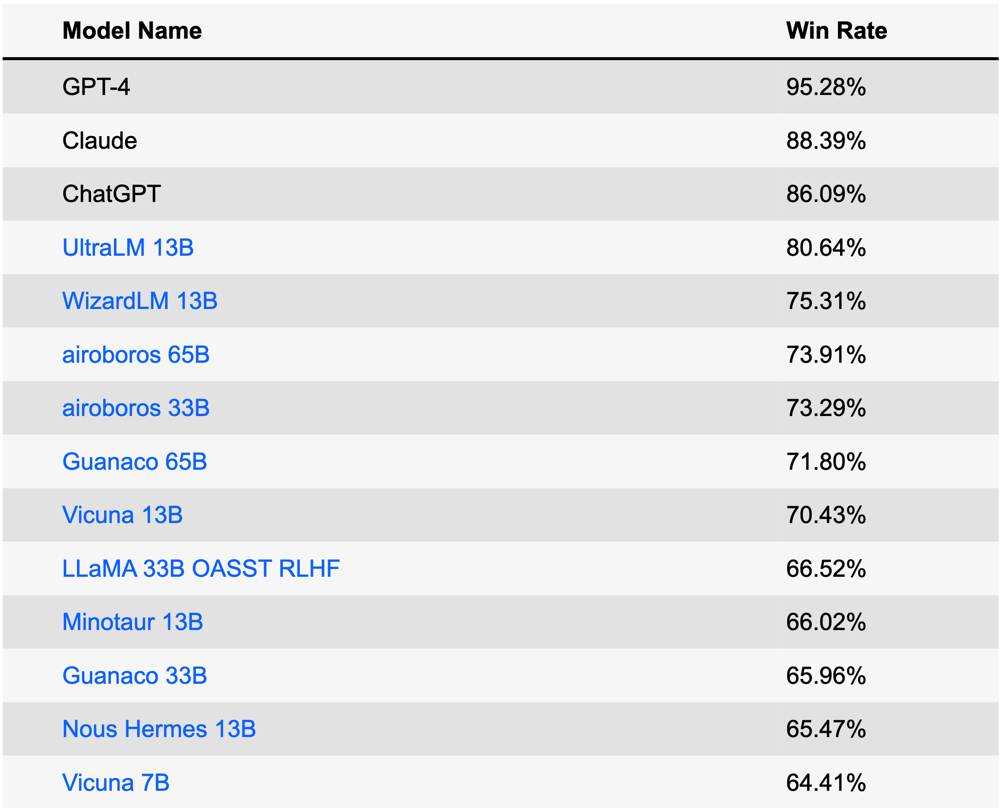
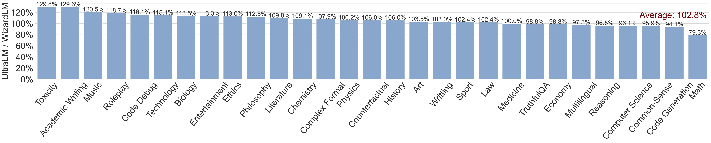
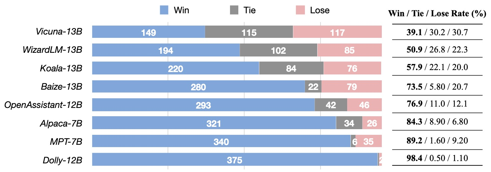
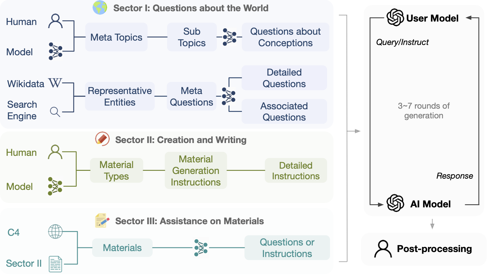
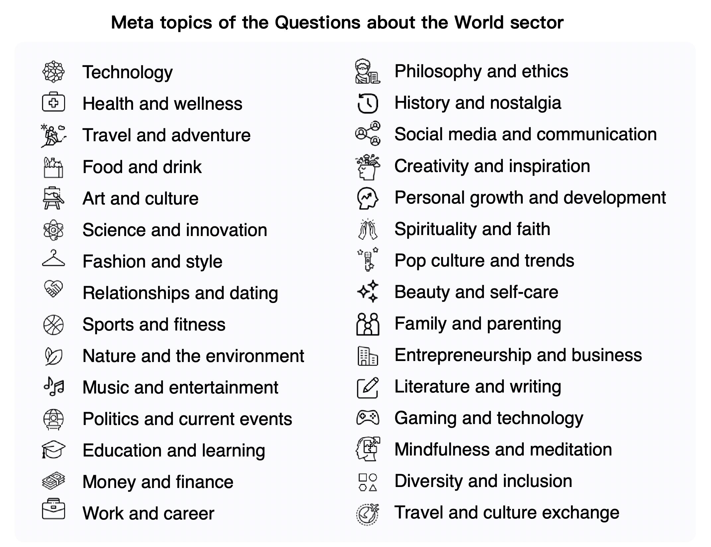

<div align="center">


**Large-scale, Informative, and Diverse Multi-round Dialogue Data, and Models**

<p align="center">
 <a href="#UltraLM"> UltraLM</a> •
  <a href="http://39.101.77.220/">Data Explorer</a> •
  <a href="https://atlas.nomic.ai/map/0ce65783-c3a9-40b5-895d-384933f50081/a7b46301-022f-45d8-bbf4-98107eabdbac">Nomic AI Atlas Explorer</a> •
  <a href="#data">Data Release</a> •
  <a href="#construction-of-ultrachat">Construction Process</a> •
    <a href="https://arxiv.org/abs/2305.14233">Paper</a>
</p>

</div>

<div align="center">


</div>


## News
- **❗️❗️ Septempber 26, 2023: Releasing a large-scale, fine-grained, diverse preference dataset [UltraFeedback](https://github.com/thunlp/UltraFeedback), a new language model [UltraLM-13B-v2.0](https://huggingface.co/openbmb/UltraLM-13b-v2.0), a reward model [UltraRM](https://huggingface.co/openbmb/UltraRM-13b) and a critic model [UltraCM](https://huggingface.co/openbmb/UltraCM-13b).**
- **❗️❗️With UltraRM, a simple best-of-16 sampling achieves 92.30% (UltraLM2, 🥇 in 13B results) and 91.54% (UltraLM, 🥇 in LLaMA-1 results) win rates against text-davinci-003 on [AlpacaEval benchmark](https://tatsu-lab.github.io/alpaca_eval/).**
- August 7, 2023: Releasing the first version of UltraLM-65B.
- June 28, 2023: UltraLM-13B ranks #1 among open-source models on [AlpacaEval Leaderboard](https://tatsu-lab.github.io/alpaca_eval/)!
- June 27, 2023: We release the first version of UltraLM-13B, a powerful chat language model trained on UltraChat!
- April 20, 2023: Released all data, more processing and additional data are expected.
- April 17, 2023: The rest of the Writing and Creation sector is released (457k). 
- April 12, 2023: The first part of the Writing and Creation sector is released.
- April 9, 2023: Supported by [gpt4all](https://github.com/nomic-ai/gpt4all), we now also have an [Atlas explorer](https://atlas.nomic.ai/map/0ce65783-c3a9-40b5-895d-384933f50081/a7b46301-022f-45d8-bbf4-98107eabdbac)
- April 8, 2023: We release a training script by taking GPT-J as an example.
- April 7, 2023: The second part of Questions about the World is released. It contains 290k generated multi-round dialogues.
- March 31, 2023: The first part of Questions about the World is released. It contains 280k generated multi-round dialogues.

## UltraLM

UltraLM is a series of chat language models trained on UltraChat. Currently, we have released the 13B version, which **ranks #1** among open-source models and **ranks #4** among all models on [AlpacaEval Leaderboard](https://tatsu-lab.github.io/alpaca_eval/) (June 28, 2023). 
UltraLM-13B is based upon LLaMA-13B and supported by [BMTrain](https://github.com/OpenBMB/BMTrain) in the training process.

#### Download

| Model  |  Link | Version |
| ------------- | ------------- |------------- |
| UltraLM-13B  | [Huggingface Repo](https://huggingface.co/openbmb/UltraLM-13b) |v1.0|
| UltraLM-65B  | [Huggingface Repo](https://huggingface.co/openbmb/UltraLM-65b) |v1.0|
| UltraLM-13B  | [Huggingface Repo](https://huggingface.co/openbmb/UltraLM-13b-v2.0) |v2.0|
| UltraRM-13B  | [Huggingface Repo](https://huggingface.co/openbmb/UltraRM-13b) |v1.0|
| UltraCM-13B  | [Huggingface Repo](https://huggingface.co/openbmb/UltraCM-13b) |v1.0|


#### Use UltraLM

- To reconstruct UltraLM, please download LLaMA-13B and our Delta weights. Please use this [link](https://huggingface.co/openbmb/UltraLM-13b) if you would like to test UltraLM, we haven't evaluated other weights provided by third parties.
- Run the script in `/UltraLM/recover.sh` to obtain the final weights of the recovered model.
- After obtaining the recovered model, replace the model path in `/UltraLM/chat_cli.sh` with your path and run to start chatting!

*Note: Different hyper-parameters or system prompts will affect the outputs. You can refer to details in `/UltraLM/inference_cli.py` for our default setting.*


<details><summary> <b> Performance </b> </summary>
<p>

We report three evaluations in this section: Alpaca-Eval from Stanford, Evol-instruct from Microsoft's WizardLM, and our curated evaluation set.
Evaluations of modern LLMs may be biased and affected by many factors, we are also actively working on more comprehensive evaluation methods.

#### Alpaca-Eval

[AlpacaEval](https://tatsu-lab.github.io/alpaca_eval/) is a leaderboard specifically designed for evaluating LLMs. The leaderboard is created based on the win-rate against Text-Davince-003 automatically evaluated by GPT-4.



#### Evol-instruct

This dataset is constructed with an evolutionary strategy by rewriting the instructions through multiple rounds to obtain instructions at different complexity levels. The benchmark is developed by the [WizardLM project](https://github.com/nlpxucan/WizardLM), another excellent chat language model!




#### Our Evaluation Set

We curate an evaluation set, encompassing the [Vicuna Benchmark](https://lmsys.org/blog/2023-03-30-vicuna/) and additional 300 questions and instructions generated by GPT-4. The questions/instructions cover a wide range of topics, including commonsense, world knowledge, professional knowledge (specifically physics and biology) , mathematics, and writing tasks on different levels of difficulty. We use GPT-4 for evaluation. [Here](data/ultra_eval.json) is the dataset.





</p>
</details>

<details><summary> <b> Examples of UltraLM </b> </summary>
<p>

- Example A: Question of Common Knowledge
  
  > **User:** Which animal is known as man's best friend?

  > **UltraLM:** There are many animals that humans enjoy as companion animals, but one of the absolute standout answers to the question "which animal is known as a man's best friend?" is the domestically-bred dog. Domesticated dogs have been by humans' sides for tens of thousands of years, providing faithful companionship and help; guarding people and property; and lending emotional support in everything from long, lonely days to military deployments. Dogs come in an almost mind-boggling variety of breeds of various sizes, with different energy levels, personalities, and temperaments, meaning there's almost certainly a pup out there who will be a perfect fit for whoever needs it most.


- Example B: Commonsense Reasoning
  
  > **User:** Which weighs more: a pound of feathers or a pound of bricks?

  > **UltraLM:** A pound of feathers and a pound of bricks both weigh exactly one pound. This is because one pound is a unit of weight, just as a foot is a unit of length or a second is a unit of time. We use the pound (or other unit of weight) to describe the weight of different objects, regardless of what that object is made of. So the answer to your question is that a pound of feathers and a pound of bricks both weigh the same amount.


- Example C: Reasoning
  
  > **User:** If a farmer has 17 sheep and all but 9 die, how many are left?

  > **UltraLM:** The total number of sheep that are left is 9.


- Example D: Reasoning
  
  > **User:** If a red house is made from red bricks, and a blue house is made from blue bricks, what is a greenhouse made from?

  > **UltraLM:** A greenhouse is not made from green bricks, but rather from materials such as glass or plastic that allow light to pass through and create a controlled environment for plants to grow. Greenhouses can come in a variety of colors, including green, but the color of the building itself does not affect the plants growing inside.


- Example E: Creation
  
  > **User:**  Write a poem about electromagnetism.

  > **UltraLM:**  Electromagnetism is a force we can't ignore,  
   It's the reason for many things we adore. In a magnetic field, a wire will glow,  
   And the electrons will align, both old and new.   
   Electricity and magnetism are hand in hand,  
   One creates a field, the other has a brand.  
   The magnetic field can push and pull,  
   On a wire with current, it will react in full.  
   The attraction and repulsion it brings,  
   Are the reason for many things.  
   From motors to generators, and much more in between,  
   Electromagnetism is at the root of what it means.  
   It's a force that's all around us,  
   From the compass to the light switch.  
   With its power, it can do much,  
   From a simple needle to a rocket's thrust.  
   It's a force we can't deny,  
   For it's a part of our lives.  
   Electromagnetism is something to admire,  
   For its strength and its might, it has no equal, it's sure.


- Example F: Creation
  
  > **User:**  Write a short story about the first second of the universe.

  > **UltraLM:**  In the first second of the universe, darkness reigned supreme. There was no light, no sound, no shape, no substance. Nothing yet was, but there was an intense power, a raw energy waiting to be unleashed. Within infinity, the first second held the potential for creation in its grasp. And then, with a mighty bang, a bright point of light emerged into existence. In it, the most fundamental particles were born, their forms yet unknown as they frenetically collided in a chaotic dance of creation. Within this primordial light, every force of nature and every component of life was stirred from pure energy to physical reality. The first atoms quickly assembled, and from these, stars and galaxies began to form. Their fusion creating a hot environment that pushed back the very void, shaping the cosmos through expanding and cooling waves. In this cosmic first, no structure of experience, not even time or space, could establish its rule. For an instant, the entirety of the universe existed in an embryonic nexus, a cosmic singularity from which all future existence originated. It was a microcosm forging the macrocosm of which it ultimately becomes a part, its moment of birth a metaphor for the cycles of creation that permeate the multiverse(s).From that single point of light, an infinite universe unfolded. For centuries, eons ahead, and forevermore, it remained the most foundational blink of its unceasing journey into the depths of the Great Beyond. The first second is the beginning of everything.
</p>
</details>


## Overview of UltraChat
This project aims to construct *open-source, large-scale, and multi-round* dialogue data powered by Turbo APIs to facilitate the construction of powerful language models with general conversational capability.
In consideration of factors such as safeguarding privacy, **we do not directly use any data available on the Internet as prompts**.

<details><summary> <b>  UltraChat is composed of three sectors </b> </summary>
<p>

- 🌏 **Questions about the World**: The dialogue data in this sector is derived from a wide range of inquiries related to concepts, entities, and objects from the real world. The topics covered are extensive, spanning areas such as technology, art, and entrepreneurship.
- ✍🏻 **Writing and Creation**: The dialogue data in this sector is driven by the demands for writing/creation from scratch, and encompasses any tasks that an AI assistant may aid within the creative process, spanning from email composition to crafting narratives and plays, and beyond.
- 📋 **Assistance on Existent Materials**: The dialogue data in this sector is generated based on existing materials, including but not limited to rewriting, continuation, summarization, and inference, covering a diverse range of topics.


</p>
</details>

*Disclaimer: Although the process of building UltraChat does NOT involve any publicly available benchmark data, scaling to a certain extent may still result in some overlap in some evaluation benchmarks. We would like to emphasize again that **all the data is automatically generated (including the instructions and responses)**, and we do not insert any open benchmark data.
For example, UltraChat was released (April, 2023) **earlier** than Alpaca Eval (May, 2023).
We encourage users to closely monitor such phenomena, while we are also actively considering how to evaluate LLMs more properly.*

<details><summary> <b>An Example of UltraChat </b> </summary>
<p>
 <div align="center">
 
 </div>
</p>
</details>


## Data

The dataset is intended solely for research and educational purposes and should not be construed as reflecting the opinions or views of the creators, owners, or contributors of this dataset. And it is distributed under the MIT license.


### Data Release
[Explore](http://39.101.77.220/) the data before downloading, or use [Atlas explorer](https://atlas.nomic.ai/map/0ce65783-c3a9-40b5-895d-384933f50081/a7b46301-022f-45d8-bbf4-98107eabdbac).

- 🤗 [Huggingface Datasets Host](https://huggingface.co/datasets/stingning/ultrachat)

Direct Download links:
- [Questions about the World [Part I + Part II]](https://cloud.tsinghua.edu.cn/f/0a27393192ad46a5a081/?dl=1)
- [Writing and Creation [Part I]](https://cloud.tsinghua.edu.cn/f/57258a87846243218a9b/?dl=1)
- [Writing and Creation [Part II]](https://cloud.tsinghua.edu.cn/f/099b4dd71b82448fb7fb/?dl=1)
- [Assistance on Existent Materials [Part I]](https://cloud.tsinghua.edu.cn/f/1f7abdf2d2564cb4b338/?dl=1)

### Data Format
Each line in the downloaded data file is a json dict containing the data id and dialogue data in a list format. Below is an example line.

```JSON
{
  "id": "0", 
  "data": [
    "How can cross training benefit groups like runners, swimmers, or weightlifters?", 
    "Cross training can benefit groups like runners, swimmers, or weightlifters in the following ways: ...", 
    "That makes sense. I've been wanting to improve my running time, but I never thought about incorporating strength training. Do you have any recommendations for specific exercises?", 
    "Sure, here are some strength training exercises that can benefit runners: ...", 
    "Hmm, I'm not really a fan of weightlifting though. Can I incorporate other forms of exercise into my routine to improve my running time?", 
    "Yes, absolutely! ...",
    "..."
    ]
}

```

## Training


We provide training code to fine-tune [LLaMa](https://github.com/facebookresearch/llama) (however we are not distributing the weights of LLaMa) on UltraChat in [`.src/`](src), the training is accelerated by [BMTrain](https://github.com/OpenBMB/BMTrain).

- Download the released data and put it under `./data`

- Run `train_bm.py`, for example:

  ```bash
  WANDB_MODE="offline" torchrun --nnodes=1 --nproc_per_node=8 --rdzv_id=1 --rdzv_backend=c10d --rdzv_endpoint=localhost:50003 train_bm.py --tensorboard ./ultrachat_llama_tb_2 --save_step 5000 --logging_step 100
  ```

We also provide a training script to fine-tune GPT-J on UltraChat in [`.src/train_legacy/`](src), which is implemented with [OpenPrompt](https://github.com/thunlp/OpenPrompt)

- Download the released data and put it under `./data`
- Run `accelerate launch train.py` to start training

## Construction of UltraChat

The general idea of UltraChat is to use separate LLMs to generate opening lines, simulate users and respond to queries.
Each sector of UltraChat has its own challenges and requires particular strategy designs. 
We will specify the construction process once a sector of UltraChat is released.

<div align="center">

</div>

<details><summary> <b>Questions about the World</b> </summary>
<p>

#### Meta Topics & Sub-Topics

- The data is derived from 30 representative and diverse meta topics (icons are from [flaticon](https://www.flaticon.com/))

<div align="center">

</div>

- Based on the above meta topics, we generate 1100+ subtopics for data construction
- For each subtopic, we generate up to 10 specific questions. 
- Then we use Turbo APIs to generate new relevant questions for each of the 10 questions. We use hand-crafted prompts to instruct the model to generate a diverse set of questions covering a wide range of common concepts and objects.
- For each question, we generate a 3~7-round dialogue using the two models iteratively as described above.

</p>

<p>

#### Common Real-world Entities

- We gather top-frequent 10000 named entities from Wikidata.
- We generate 5 meta questions for each entity using ChatGPT API.
- For each meta question, we generate 10 more specific questions and 20 related but general questions.
- We sample 200k specific questions and 250k general questions along with the 50k meta-questions, and we generate a 3~7-round dialogue for each.

</p>

</details>

<details><summary> <b>Writing and Creation</b> </summary>
<p>

- We first collect 20 types of writing, as shown below (icons are from [flaticon](https://www.flaticon.com/)).

<div align="center">

</div>

- For each type of writing, generate 200 different instructions that ask an AI assistant to generate text material, and 80% of the instructions are further expanded and detailed.
- Use the generated instructions as initial input and generate a 2~4-round dialogue each.

</p>
</details>

<details><summary> <b>Assistance on Existent Materials</b> </summary>
<p>

- We extract ~10w diverse materials from C4 dataset.
- We generate up to 5 questions/instructions for each piece of material.
- We combine the material with each question/instruction with a set of manually designed template as the initial input of a user to start a dialogue with AI assistant.
- For each input, we generate a 2~4-round dialogue.

</p>
</details>


## To Do
- [x] Release the rest part of the data for Questions about the World.
- [x] Continue to release the data of Writing and Creation.
- [x] Continue to release the data of  Assistance on Existent Materials in the future.
- [x] Train a model on UltraChat and conduct in-detail analysis. Welcome to use it to train your chat model!
- [ ] There will be a Chinese version of UltraChat.


## Limitations
- Although UltraChat could perform promisingly on several benchmarks, it still has limitations such as hallucinations. In our experience, UltraLM could handle questions in terms of world knowledge and creation. The reasoning, math, and coding abilities still need to be explicitly enhanced.


## Citation
Feel free to cite the repo if you think UltraChat is useful.

```bibtex
@article{ding2023enhancing,
  title={Enhancing Chat Language Models by Scaling High-quality Instructional Conversations},
  author={Ding, Ning and Chen, Yulin and Xu, Bokai and Qin, Yujia and Zheng, Zhi and Hu, Shengding and Liu, Zhiyuan and Sun, Maosong and Zhou, Bowen},
  journal={arXiv preprint arXiv:2305.14233},
  year={2023}
}
```
